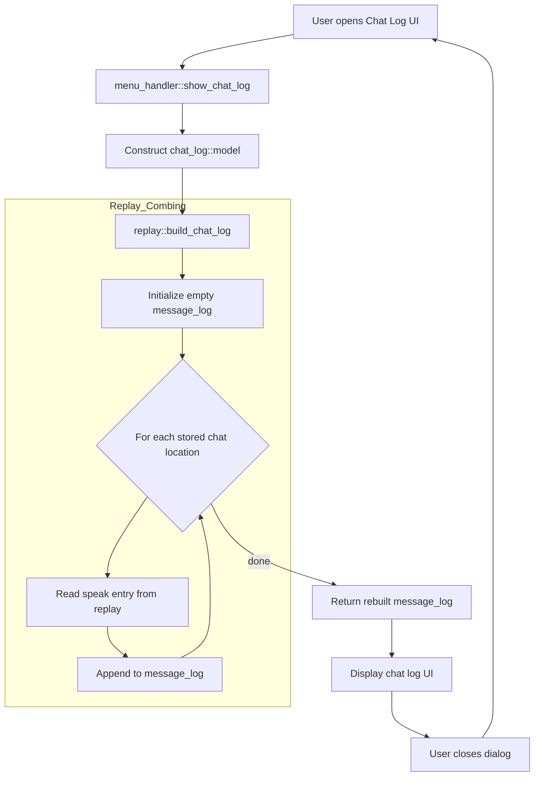
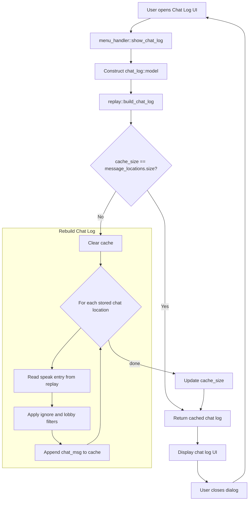

# Contribution [#]: Please cache the chatlog

**Contribution Number:** [1 / **<ins>2</ins>** / 3]  
**Student:** Alex Schectman  
**Issue:** [#1086](https://github.com/wesnoth/wesnoth/issues/1086)  
**Status:** [Phase I / **<ins>Phase II</ins>** / Phase III / Phase IV] [In Progress / **<ins>Complete</ins>**]

---

## Why I Chose This Issue

Recommended by a maintainer while I was working on another issue. Gets into the guts of the codebase with some simple I/O. Old issue, so not critical or pressing.

---

## Understanding the Issue

### Problem Description

Launching the chat log window triggers iteration over all related chat records in the the related save or replay file to populate the GUI. Repeated O(n) operation that gets slower every time. 

### Expected Behavior

Logs should be cached for quick access until new messages arrived.

### Current Behavior



### Affected Components

`src/replay.cpp:364-379`

---

## Reproduction Process

### Environment Setup

See [previous README.](https://github.com/schectma/su26-ai301-contribution/blob/main/README.md)

### Steps to Reproduce

#### Visually

1. Launch Wesnoth and click the button at the bottom-left corner of the screen that says "i About".
2. Click Paths in the list on the left of the window that pops up and note the location of saved games.
3. Return to the main menu, click Preferences > Advanced > Compress saved games, then select No from the dropdown.
4. Return to the main menu, start a new local multiplayer game, and do one or both of the following:

    a. Manually add multiple messages.

    1.  Click Actions > Speak (or press `m` on keyboard), type any message, then hit enter. Repeat at least once more.

    b. Auto-populate save file with spam (more dramatic).

    1. Click Actions > Speak (or press `m` on keyboard), type any message, then hit enter.
    2. Click Menu > Save Replay, name it as desired, then click Save. Quit and close Wesnoth.
    3. Navigate to previously ascertained saved games location and open the generated replay file (it probably won't have an extension but should be recognizable by name).
    4. Run the following in the CLI:
    ```
    (
    for i in $(seq 1 5000); do
      t=$((1782839657 + i))
      cat <<EOF
        [command]
            undo=no
            [speak]
                id="asche"
                message="msg $i"
                side=1
                time=$t
            [/speak]
        [/command]
    EOF
    done
    ) > spam.txt
    ```
    5. Copy contents of generated `spam.txt` and paste into save/replay file immediately after existing speak commands. Save file.

5. Relaunch Wesnoth, click Load, and select the same save/replay file. Click the play button (▶️) and let it run the replay.
6. Click Menu > Chat log (or `alt+c`). Repeat at least once.
7. Observe CLI output (in code editor) for readouts of tags read per chat log launch.

#### Via Debug

1. Set breakpoint at `src/replay.cpp:370` and launch game using debugger of choice.
2. Follow steps 1-9 above.
3. Step over and out of for loop repeatedly, observing its repetition.

### Reproduction Evidence

- **Commit showing reproduction:** [069310](https://github.com/wesnoth/wesnoth/commit/3e8af53f92434898da074230eed63f24018dc80e)
- **Screenshots/logs:** 
- **My findings:** `[speak]` tag section of replay file is in fact iterated over each time the chat log is launched in-game.

---

## Solution Approach

### Analysis

Line 372 clears and rebuilds the chat log from scratch each time it's opened in-game.

### Proposed Solution

Cache fully-built chat log and rebuild only when a new message is added.


### Implementation Plan

Using UMPIRE framework (adapted):

**Understand:** Reopening the chat log repeatedly performs the same O(n) process, even when neither the replay nor the chat history has changed.

**Match:** `src/help/help.cpp:106-107 & :128-139` caches a computed result, stores the source collection's size, and rebuilds only when the current size differs.

**Plan:** [Step-by-step implementation plan]
1. [Modify file X to do Y]
2. [Add function Z]
3. [Update tests]

**Implement:** [Link to your branch/commits as you work]

**Review:** [Self-review checklist - does it follow the project's contribution guidelines?]

**Evaluate:** [How will you verify it works?]

---

## Testing Strategy

### Unit Tests

- [ ] Test case 1: [Description]
- [ ] Test case 2: [Description]
- [ ] Test case 3: [Description]

### Integration Tests

- [ ] Integration scenario 1
- [ ] Integration scenario 2

### Manual Testing

[What you tested manually and results]

---

## Implementation Notes

### Week [X] Progress

[What you built this week, challenges faced, decisions made]

### Week [Y] Progress

[Continue documenting as you work]

### Code Changes

- **Files modified:** [List]
- **Key commits:** [Links to important commits]
- **Approach decisions:** [Why you chose certain approaches]

---

## Pull Request

**PR Link:** [GitHub PR URL when submitted]

**PR Description:** [Draft or final PR description - much of the content above can be adapted]

**Maintainer Feedback:**
- [Date]: [Summary of feedback received]
- [Date]: [How you addressed it]

**Status:** [Awaiting review / Iterating / Approved / Merged]

---

## Learnings & Reflections

### Technical Skills Gained

[What you learned technically]

### Challenges Overcome

[What was hard and how you solved it]

### What I'd Do Differently Next Time

[Reflection on your process]

---

## Resources Used

- [Link to helpful documentation]
- [Tutorial or Stack Overflow post that helped]
- [GitHub issues or discussions that helped]
