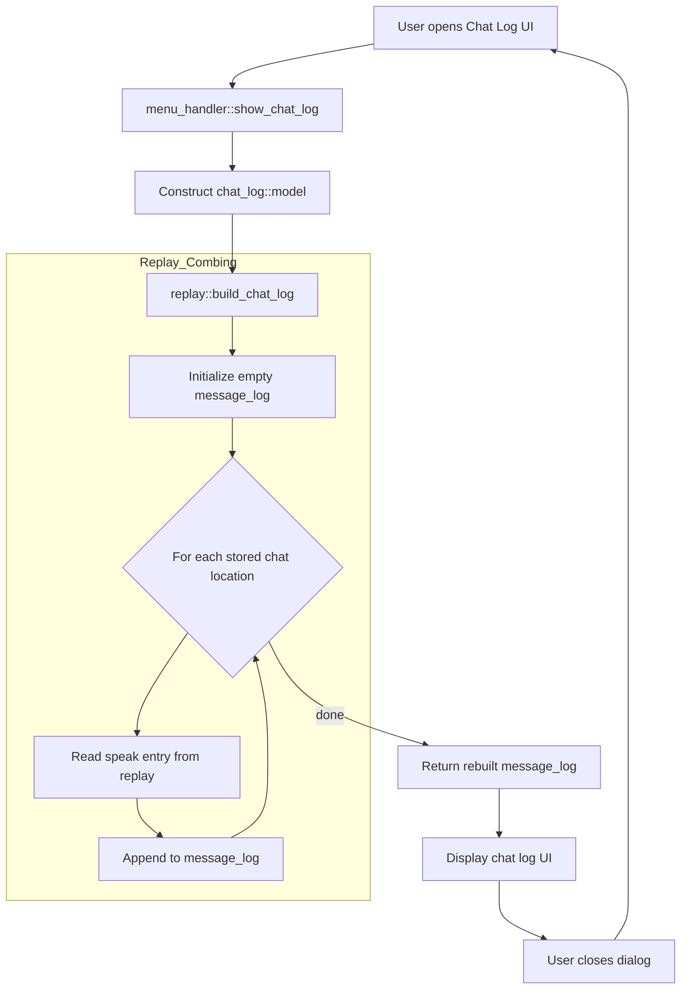
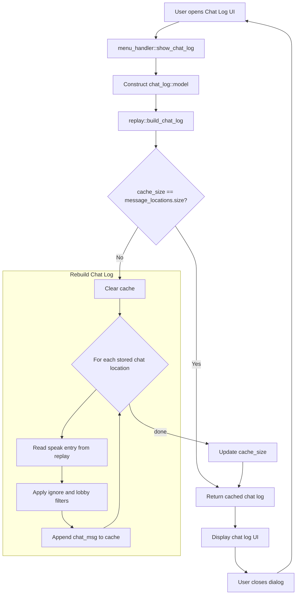

# Contribution [#]: Please cache the chatlog

**Contribution Number:** [1 / **<ins>2</ins>** / 3]  
**Student:** Alex Schectman  
**Issue:** [#1086](https://github.com/wesnoth/wesnoth/issues/1086)  
**Status:** [Phase I / Phase II / Phase III / **<ins>Phase IV</ins>**] [In Progress / **<ins>Complete</ins>**]

---

## Why I Chose This Issue

Recommended by a maintainer while I was working on another issue. Gets into the guts of the codebase with some simple I/O. Old issue, so not critical or pressing.

---

## Understanding the Issue

### Problem Description

Launching the chat log window triggers iteration over all related chat records in the the related save or replay file to populate the GUI. Repeated O(n) operation that gets slower every time. 

### Expected Behavior

Logs should be cached for quick access until new messages arrived.

### Current Behavior



### Affected Components

`src/replay.cpp:364-379`

---

## Reproduction Process

### Environment Setup

See [previous README.](https://github.com/schectma/su26-ai301-contribution/blob/main/README.md)

### Steps to Reproduce

#### Visually

1. Launch Wesnoth and click the button at the bottom-left corner of the screen that says "i About".
2. Click Paths in the list on the left of the window that pops up and note the location of saved games.
3. Return to the main menu, click Preferences > Advanced > Compress saved games, then select No from the dropdown.
4. Return to the main menu, start a new local multiplayer game, and do one or both of the following:

    a. Manually add multiple messages.

    1.  Click Actions > Speak (or press `m` on keyboard), type any message, then hit enter. Repeat at least once more.

    b. Auto-populate save file with spam (more dramatic).

    1. Click Actions > Speak (or press `m` on keyboard), type any message, then hit enter.
    2. Click Menu > Save Replay, name it as desired, then click Save. Quit and close Wesnoth.
    3. Navigate to previously ascertained saved games location and open the generated replay file (it probably won't have an extension but should be recognizable by name).
    4. Run the following in the CLI:
    ```
    (
    for i in $(seq 1 5000); do
      t=$((1782839657 + i))
      cat <<EOF
        [command]
            undo=no
            [speak]
                id="asche"
                message="msg $i"
                side=1
                time=$t
            [/speak]
        [/command]
    EOF
    done
    ) > spam.txt
    ```
    5. Copy contents of generated `spam.txt` and paste into save/replay file immediately after existing speak commands. Save file.

5. Relaunch Wesnoth, click Load, and select the same save/replay file. Click the play button (▶️) and let it run the replay.
6. Click Menu > Chat log (or `alt+c`). Repeat at least once.
7. Observe CLI output (in code editor) for readouts of tags read per chat log launch.

#### Via Debug

1. Set breakpoint at `src/replay.cpp:370` and launch game using debugger of choice.
2. Follow steps 1-9 above.
3. Step over and out of for loop repeatedly, observing its repetition.

### Reproduction Evidence

- **Commit showing reproduction:** [069310](https://github.com/wesnoth/wesnoth/commit/3e8af53f92434898da074230eed63f24018dc80e)
- **Screenshots/logs:** 
- **My findings:** `[speak]` tag section of replay file is in fact iterated over each time the chat log is launched in-game.

---

## Solution Approach

### Analysis

Line 372 clears and rebuilds the chat log from scratch each time it's opened in-game.

### Proposed Solution

Cache fully-built chat log and rebuild only when a new message is added.


### Implementation Plan

Using UMPIRE framework (adapted):

**Understand:** Reopening the chat log repeatedly performs the same O(n) process, even when neither the replay nor the chat history has changed.

**Match:** `src/help/help.cpp:106-107 & :128-139` caches a computed result, stores the source collection's size, and rebuilds only when the current size differs.

**Plan:**
1. Refactor `message_log` and add corresponding counter/gauge into scope of `replay` object in `replay.hpp`.
2. Add a check to `build_chat_log()` in `replay.cpp` to prevent chat log rebuild if aforementioned counter is unchanged.
3. Test and commit each of the above steps.

**Implement:** [11346](https://github.com/wesnoth/wesnoth/pull/11346)

**Review:** Confirm modifications don't affect any other parts of the codebase. Ensure project naming and formatting conventions are respected (and just avoid inconsistencies). Diff changes locally to avoid losing critical pre-existing code.

**Evaluate:** Just run the game and test the exact feature being modified. Set a breakpoint and run via debugger to verify.

---

## Testing Strategy

### Unit Tests

N/A

### Integration Tests

N/A

### Manual Testing

- [x] Replay chaining/swapping
- [x] Save chaining/swapping
- [x] Multiplayer (join existing game)

---

## Implementation Notes

### Week 2 Progress

Formulated and applied solution (mostly based on AI suggestions) and opened PR.

### Week 2 Progress

Addressed maintainer suggestions and pushed to PR.

### Week 3 Progress

Addressed maintainer suggestions and pushed to PR. Awaiting what should be final review.

### Week 4 Progress

Pinged maintainer. Screen recordings of testing were ready over a week ago and the CI/CD tests all passed, so I just need them to give it a once-over and approve.

### Code Changes

- **Files modified:** `src/replay.cpp`; `src/replay.hpp`
- **Key commits:** [da7ab68](https://github.com/wesnoth/wesnoth/pull/11346/changes/da7ab68a858250316eb05dbeb57a93ba0b8918cf)
- **Approach decisions:** Moved chat log from global to relevant class scope to make addressing the issue easier and reduce necessary cleanup.

---

## Pull Request

**PR Link:** [11346](https://github.com/wesnoth/wesnoth/pull/11346)

**PR Description:** Attempts to address #1086. Re-scopes message_log and its new corresponding counter/gauge to the replay class, then determines whether to rebuild the chat log depending on whether that counter/gauge has changed.

**Maintainer Feedback:**
- 20260712: Does this work as expected when loading saves vs replays vs joining an in-progress online game?
- 20260715: Tested all of the above and followed up with maintainer.

**Status:** [Awaiting review / Iterating / Approved / **<ins>Merged</ins>**]

---

## Learnings & Reflections

Mature C++ projects often have their own utility libraries and maintainers like when they're used.

### Technical Skills Gained

Mostly Git and version control.

### Challenges Overcome

Figuring out I/O for this specific pipeline in the game; navigating maintainer preferences.

### What I'd Do Differently Next Time

Reference project utilities and assess for code smells before formulating changes.

---

## Resources Used

- [Link to helpful documentation]
- [Tutorial or Stack Overflow post that helped]
- [GitHub issues or discussions that helped]
