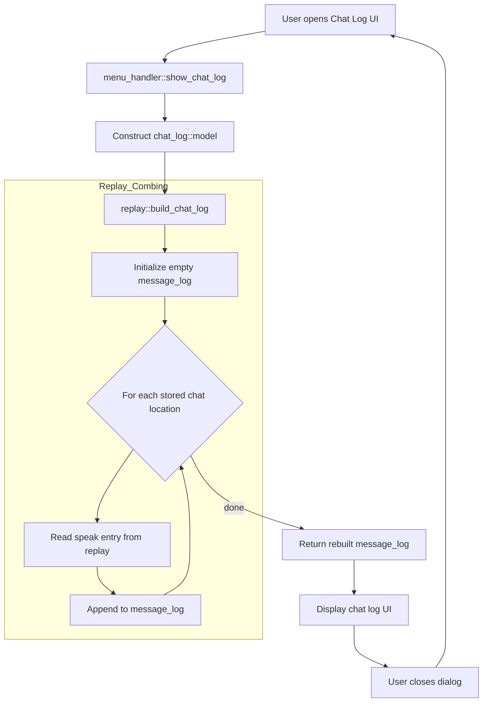

# Contribution [#]: Please cache the chatlog

**Contribution Number:** [1 / **2** / 3]  
**Student:** Alex Schectman  
**Issue:** [#1086](https://github.com/wesnoth/wesnoth/issues/1086)  
**Status:** [**Phase I** / Phase II / Phase III / Phase IV] [**<ins>In Progress</ins>** / Complete]

---

## Why I Chose This Issue

Recommended by a maintainer while I was working on another issue. Gets into the guts of the codebase with some simple I/O. Old issue, so not critical or pressing.

---

## Understanding the Issue

### Problem Description

Launching the chat log window triggers iteration over the entire related save or replay file to populate the GUI. Repeated O(n) operation that gets slower every time. 

### Expected Behavior

Logs should be cached for quick access until new messages arrived.

### Current Behavior



### Affected Components

`src/replay.cpp:364-379`

---

## Reproduction Process

### Environment Setup

See [previous README.](https://github.com/schectma/su26-ai301-contribution/blob/main/README.md)

### Steps to Reproduce

#### Visually

1. Launch Wesnoth and click the button at the bottom-left corner of the screen that says "i About".
2. Click Paths in the list on the left of the window that pops up and note the location of saved games.
3. Return to the main menu, click Preferences > Advanced > Compress saved games, then select No from the dropdown.
4. Return to the main menu, start a new local multiplayer game, click Actions > Speak (or press `m` on keyboard), type any message, then hit enter.
5. Click Menu > Save Replay, name it as desired, then click Save. Quit and close Wesnoth.
6. Navigate to previously ascertained saved games location and open the generated replay file (it probably won't have an extension but should be recognizable by name).
7. Run the following in the CLI:
```
(
for i in $(seq 1 5000); do
  t=$((1782839657 + i))
  cat <<EOF
    [command]
        undo=no
        [speak]
            id="asche"
            message="msg $i"
            side=1
            time=$t
        [/speak]
    [/command]
EOF
done
) > spam.txt
```
8. Copy contents of generated `spam.txt` and paste into save/replay file immediately after existing speak commands. Save file.
9. Relaunch Wesnoth, click Load, and select the same save/replay file. Click the play button (▶️).
10. Observe time taken to load chat files.

#### Via Debug

1. Set breakpoint at `src/replay.cpp:370` and launch game using debugger of choice.
2. Follow steps 1-9 above.
3. Step over and out of for loop repeatedly, observing its repetition.

### Reproduction Evidence

- **Commit showing reproduction:** [Link to commit in your fork]
- **Screenshots/logs:** [If applicable]
- **My findings:** [What you discovered during reproduction]

---

## Solution Approach

### Analysis

[Your analysis of the root cause - what's causing the issue?]

### Proposed Solution

[High-level description of your fix approach]

### Implementation Plan

Using UMPIRE framework (adapted):

**Understand:** [Restate the problem]

**Match:** [What similar patterns/solutions exist in the codebase?]

**Plan:** [Step-by-step implementation plan]
1. [Modify file X to do Y]
2. [Add function Z]
3. [Update tests]

**Implement:** [Link to your branch/commits as you work]

**Review:** [Self-review checklist - does it follow the project's contribution guidelines?]

**Evaluate:** [How will you verify it works?]

---

## Testing Strategy

### Unit Tests

- [ ] Test case 1: [Description]
- [ ] Test case 2: [Description]
- [ ] Test case 3: [Description]

### Integration Tests

- [ ] Integration scenario 1
- [ ] Integration scenario 2

### Manual Testing

[What you tested manually and results]

---

## Implementation Notes

### Week [X] Progress

[What you built this week, challenges faced, decisions made]

### Week [Y] Progress

[Continue documenting as you work]

### Code Changes

- **Files modified:** [List]
- **Key commits:** [Links to important commits]
- **Approach decisions:** [Why you chose certain approaches]

---

## Pull Request

**PR Link:** [GitHub PR URL when submitted]

**PR Description:** [Draft or final PR description - much of the content above can be adapted]

**Maintainer Feedback:**
- [Date]: [Summary of feedback received]
- [Date]: [How you addressed it]

**Status:** [Awaiting review / Iterating / Approved / Merged]

---

## Learnings & Reflections

### Technical Skills Gained

[What you learned technically]

### Challenges Overcome

[What was hard and how you solved it]

### What I'd Do Differently Next Time

[Reflection on your process]

---

## Resources Used

- [Link to helpful documentation]
- [Tutorial or Stack Overflow post that helped]
- [GitHub issues or discussions that helped]
